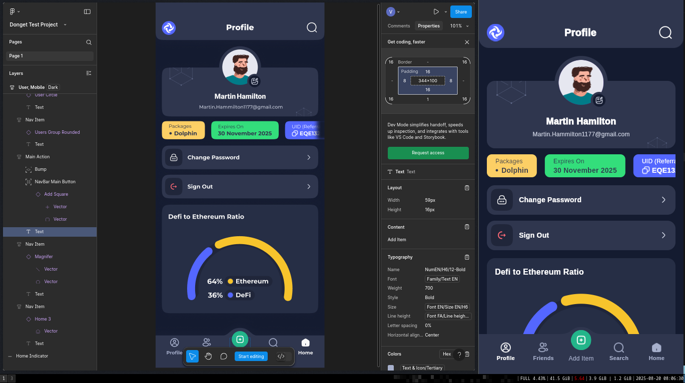
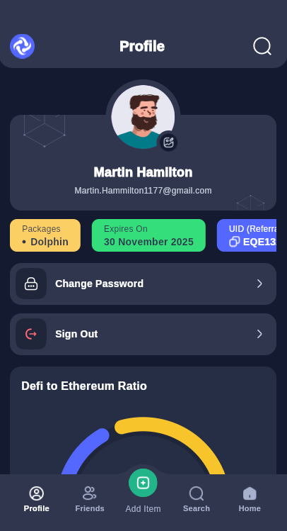
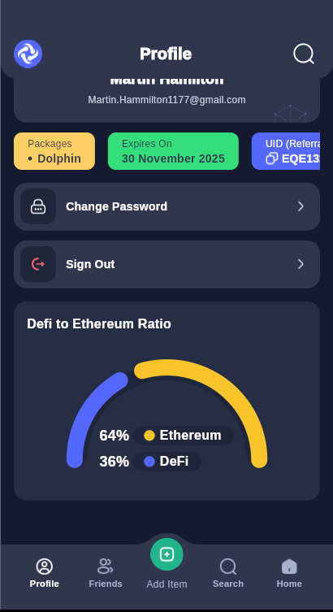

# Donget Test Project



## Overview

This project was developed as a test assignment for Donget in Flutter.

### Technical Features
- **Responsive Design**: Adapts to different screen sizes
- **Smooth Animations**: Bouncing scroll physics and material design interactions
- **Clipboard Integration**: Copy UID functionality with user feedback
- **Custom Widgets**: Reusable components with proper separation of concerns
- **Asset Management**: Organized icon and image assets

## Architecture

The project follows a clean, modular architecture:

```
lib/
├── constants/          # App-wide constants
│   ├── app_colors.dart     # Color definitions
│   ├── app_dimensions.dart # Spacing and sizing constants
│   ├── app_text_styles.dart # Typography styles
│   └── app_icons.dart      # Icon asset references
├── models/             # Data models
│   └── user.dart           # User data model
├── widgets/            # Reusable UI components
│   ├── header.dart         # App header
│   ├── profile_card.dart   # User profile display
│   ├── info_cards.dart     # Information cards
│   ├── menu_items.dart     # Settings menu
│   ├── gauge_chart.dart    # Custom chart component
│   ├── custom_navigation_bar.dart # Bottom navigation
│   └── custom_floating_action_button.dart # FAB
└── main.dart          # App entry point
```

## Development Challenges & Solutions

### Challenge 1: Custom Gauge Chart Implementation

**Problem**: Creating a smooth, responsive gauge chart without external dependencies.
**Solution**: Implemented using Flutter's `CustomPaint` with mathematical calculations for smooth arc rendering and proper color transitions that my datascience background helped me a lot.

### Challenge 2: Custom Navigation Bar

**Problem**: Creating a notched bottom navigation bar with FBA.
**Solution**: Used `BottomAppBar` with custom shape and proper positioning for the floating action button.

## UI Development Comparison

I was provided with the following UI design template in Figma to implement:


<hr>

Below are the resulting screens I developed in Flutter:




<hr>

*This project was developed as a test assignment for Donget in Flutter.*
